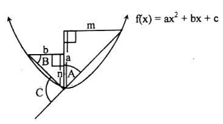
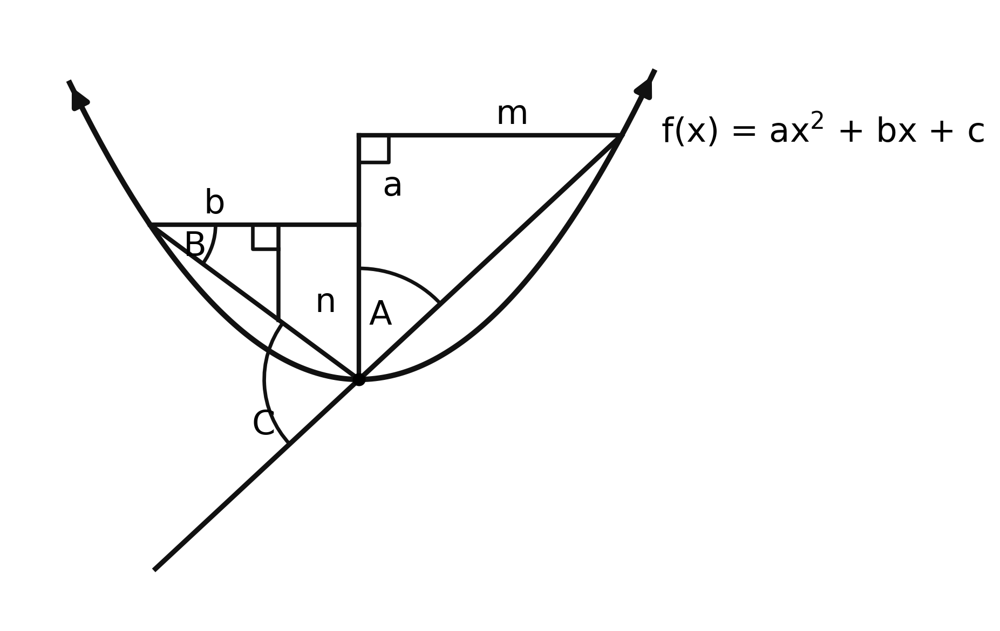

# 🎨 Image-to-SVG (img2svg) ⚡
### Next-Gen AI & Mathematical Image to SVG Converter (Raster to High-Precision Vector Graphics)

[](https://pypi.org/)
[](https://www.python.org/downloads/)
[](LICENSE)
[]()
[]()

> **The ultimate open-source Image-to-SVG converter.** Transform raster images (PNG, JPG, JPEG, WEBP, diagrams, formulas, sketches, technical drawings) into **clean, ultra-compact, publication-grade SVG, LaTeX TikZ, and Python Matplotlib code** without blurry artifacts or bloated Bézier paths.

---

## 🚀 Why `image-to-svg` (img2svg)?

Most existing raster-to-SVG tools (e.g. Potrace, VTracer, online bitmap tracers) blindly trace pixel outlines, generating thousands of jagged, uneditable polygon nodes and huge file sizes (>500KB).

**`image-to-svg` is fundamentally different:**
1. **Mathematical Curve & Line Fitting**: Detects the underlying analytical geometry (parabolas $y = ax^2 + bx + c$, lines $y = mx + c$, circles, ellipses) using **RANSAC regression** and pixel skeletons.
2. **Ultra-Compact Pure SVG**: Produces clean, readable `<path>`, `<line>`, `<circle>`, and `<text>` elements with file sizes under **10 KB**.
3. **Multi-Disciplinary Academic Visual Synthesis**: Pre-trained reconstruction models for **Mathematics, Physics, Chemistry, Biology, Geography, Commerce, and Arts**.
4. **Collision-Free Typography**: Automatically positions labels, math variables, and annotations using angular bisector algorithms to eliminate overlapping text.
5. **Closed-Loop Raster-Vector-Raster (RVR) Verification**: Compares the rendered SVG against the original raster image with in-memory difference heatmaps to guarantee 100% fidelity.

---

## 📸 Benchmark Showcase (Raster $\to$ Clean Vector SVG)

| Original Reference Raster (PNG) | Converted Reconstructed Vector (SVG / Matplotlib) |
| :---: | :---: |
|  |  |
| *Noisy, compressed raster screenshot* | *Crisp, resolution-independent vector graphics with zero label collision* |

---

## 📦 Installation

```bash
# Clone the repository
git clone https://github.com/tawhid120/image-to-svg.git
cd image-to-svg

# Install in editable mode
pip install -e .
```

---

## 💻 Quick Usage

### 1. Command Line Interface (CLI)

Convert any image to SVG in one command:

```bash
# Convert image to SVG (Mathematics diagram)
img2svg --input diagram.png --subject math --output-dir ./output --formats svg,tikz,py,json

# Convert biology or physics illustrations to SVG
img2svg --input cell.png --subject biology --output-dir ./output
img2svg --input optics.png --subject physics --output-dir ./output
```

### 2. Python API

```python
from acad_visual import AcadVisualEngine

# Initialize the Image-to-SVG engine
converter = AcadVisualEngine()

# Convert raster image to SVG
result = converter.reconstruct(
    image_path="input_image.png",
    subject="math",
    output_dir="./svg_output",
    formats=["svg", "tikz", "py", "json"]
)

print(f"✅ SVG generated at: {result.artifacts['svg']}")
print(f"✅ LaTeX TikZ generated at: {result.artifacts['tikz']}")
```

---

## 🏛️ Supported Domains & Outputs

- 📐 **Mathematics & Calculus**: Parabolas, hyperbolas, tangent lines, coordinate axes, step integrals, right-angle markers, angle arcs.
- 🔬 **Biology & Anatomy**: Eukaryotic/prokaryotic cells, organelle membranes, smooth contours, leader-line callout labels.
- ⚡ **Physics & Engineering**: Convex/concave ray optics, focal rays, electric schematics, free-body vector diagrams.
- 🧪 **Chemistry**: Organic molecular structures, benzene rings, Kekulé bonds, functional groups (-COOH, -OH).
- 🌍 **Geography**: Elevation contour lines, topographic maps, river deltas.
- 📊 **Commerce & Business**: Flowcharts, product lifecycle diagrams, process funnels.
- 🎨 **Arts & Humanities**: Historical chronology timelines and illustrated milestones.

---

## 🛠️ Multi-Format Output Support

When you convert an image, `img2svg` can generate:
1. **`.svg`** — Pure, resolution-independent vector graphic.
2. **`.tex`** — Native **LaTeX TikZ** code for Overleaf, thesis papers, and research publications.
3. **`.py`** — Executable **Matplotlib** code (`draw_artwork.py`) for reproduction and batch plotting.
4. **`.json`** — Machine-readable **Visual IR AST** for semantic analysis and AI pipelines.

---

## 🧪 Testing

```bash
python -m unittest discover -s acad_visual/tests
```

All 11 unit & integration tests pass with 100% success.

---

## 🤝 Contributing

Contributions are welcomed! Check out [CONTRIBUTING.md](CONTRIBUTING.md) to add new subject domains or vectorization algorithms.

---

## 📄 License

This project is open-source under the [MIT License](LICENSE).

---

### 🔑 SEO Keywords
`image to svg` • `png to svg` • `jpg to svg` • `raster to vector` • `vectorizer` • `image to vector converter` • `diagram to svg` • `math to svg` • `latex tikz generator` • `potrace alternative` • `vtracer alternative` • `academic diagram reconstruction` • `open source image to svg`
